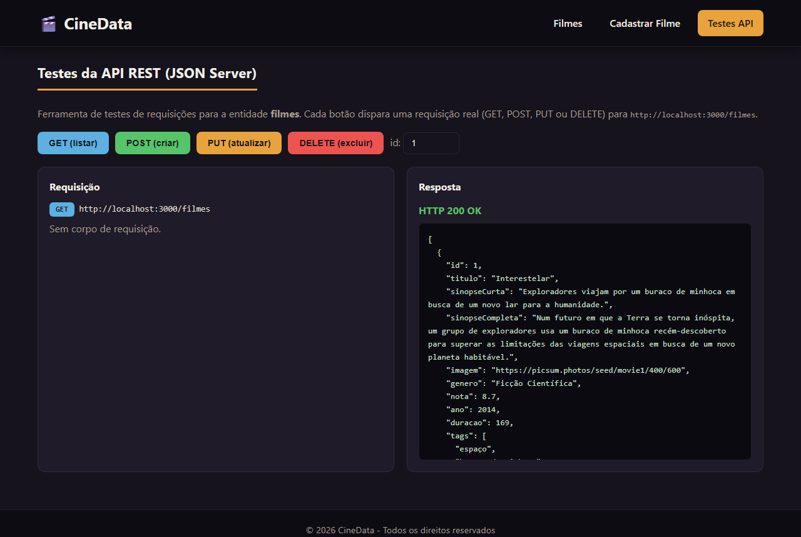
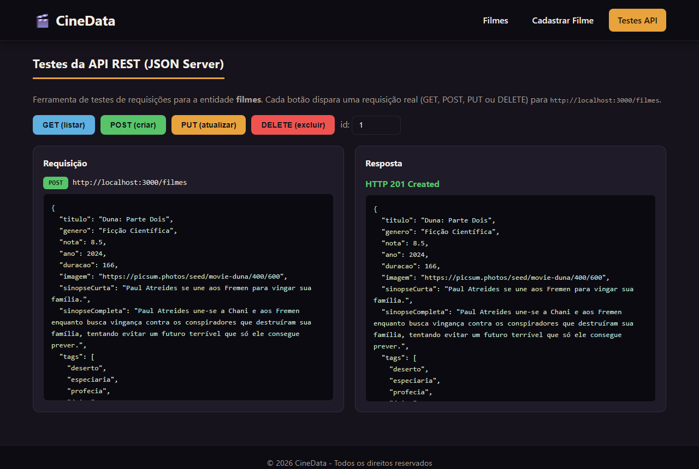
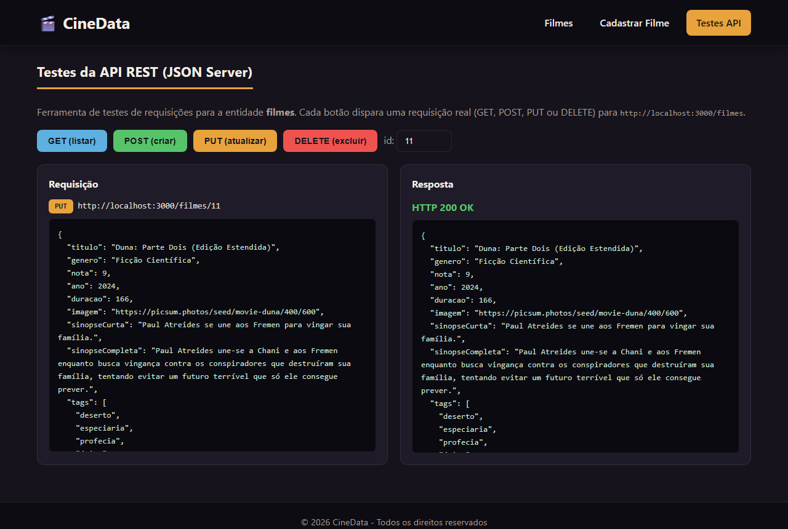
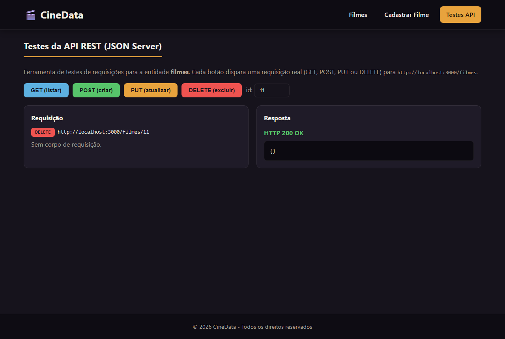

# Trabalho Prático - Semana 16

Back end com **CRUD** completo no **JSON Server**. A entidade principal (`filmes`) é servida por uma API RESTful a partir de `db/db.json`, e o front-end consome e manipula os dados via **API Fetch** (GET, POST, PUT e DELETE).

## Informações do trabalho

- **Nome:** Lucas Oliveira Dias
- **Matricula:** 907253
- **Proposta de projeto escolhida:** CineData — catálogo de filmes
- **Breve descrição:** Aplicação que cataloga filmes com listagem, página de detalhes por QueryString, cadastro, edição e exclusão (CRUD completo) sobre a entidade principal `filmes`, servida pelo JSON Server.

## Testes da API (Etapa 2)

Foi criada uma página de testes de requisições (`public/teste_api.html`) que dispara requisições reais para `http://localhost:3000/filmes`. Abaixo, o resultado de cada método HTTP:

### GET — listar filmes

### POST — criar filme

### PUT — atualizar filme

### DELETE — excluir filme

> Observação: os prints acima foram gerados por uma página de testes de API própria (que executa requisições Fetch reais). Caso seja exigida a ferramenta nomeada, os mesmos testes podem ser reproduzidos no Postman/Thunder Client/Insomnia usando as mesmas URLs e corpos.
