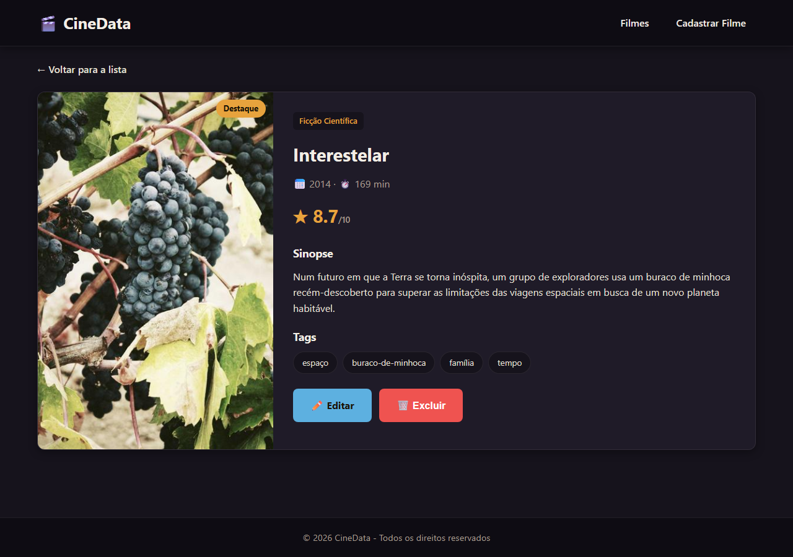

[](https://classroom.github.com/a/HRjrL6No)

# Trabalho Prático - Semana 16

Back end com **CRUD** completo no **JSON Server**. A entidade principal (`filmes`) é servida por uma API RESTful a partir de `db/db.json`, e o front-end consome e manipula os dados via **API Fetch** (GET, POST, PUT e DELETE).

## Informações do trabalho

- **Nome:** Lucas Oliveira Dias
- **Matricula:** 907253
- **Proposta de projeto escolhida:** CineData — catálogo de filmes
- **Breve descrição:** Aplicação que cataloga filmes com listagem, página de detalhes por QueryString, cadastro, edição e exclusão (CRUD completo) sobre a entidade principal `filmes`, servida pelo JSON Server.

## Como executar

```bash
npm install
npm start          # sobe o JSON Server em http://localhost:3000
```

Abra as páginas de `public/` no navegador. Endpoints: `/filmes`, `/filmes/{id}`, `/generos`.

## Páginas e CRUD

- **index.html / script.js** — lista os filmes (GET) e permite **Excluir** (DELETE) diretamente do card, com atualização dinâmica da DOM.
- **details.html / details.js** — detalhes de um filme via QueryString (`details.html?id=1`), com botões Editar e Excluir.
- **cadastro_filme.html** — formulário com validação no front-end que faz **Create (POST)** e, quando acessado com `?id=`, entra em modo de edição fazendo **Update (PUT)**.
- **teste_api.html / teste_api.js** — página de testes das requisições da API.

Ciclo CRUD implementado com Fetch:

| Operação | Método HTTP | Onde |
| -------- | ----------- | ---- |
| Create   | POST        | cadastro_filme.html |
| Read     | GET         | index.html / details.html |
| Update   | PUT         | cadastro_filme.html?id= |
| Delete   | DELETE      | card da lista / detalhes |

## Páginas da aplicação (Etapa 3)

### Página inicial (index.html)


### Página de detalhes (details.html)


### Requisições Fetch (GET e POST)

Os prints abaixo evidenciam as requisições **Fetch** feitas à API, com a confirmação da inserção (POST → HTTP 201) do registro no `db.json` do JSON Server:


## Testes da API (Etapa 2)

Resultado de cada método HTTP disparado para `http://localhost:3000/filmes`:

### GET — listar filmes


### POST — criar filme


### PUT — atualizar filme


### DELETE — excluir filme


> Observação: os prints de requisições foram gerados por uma página de testes de API própria (que executa requisições Fetch reais). Os mesmos testes podem ser reproduzidos no Postman/Thunder Client/Insomnia (Etapa 2) e na aba **Network** do DevTools (Etapa 3) usando as mesmas URLs e corpos.
